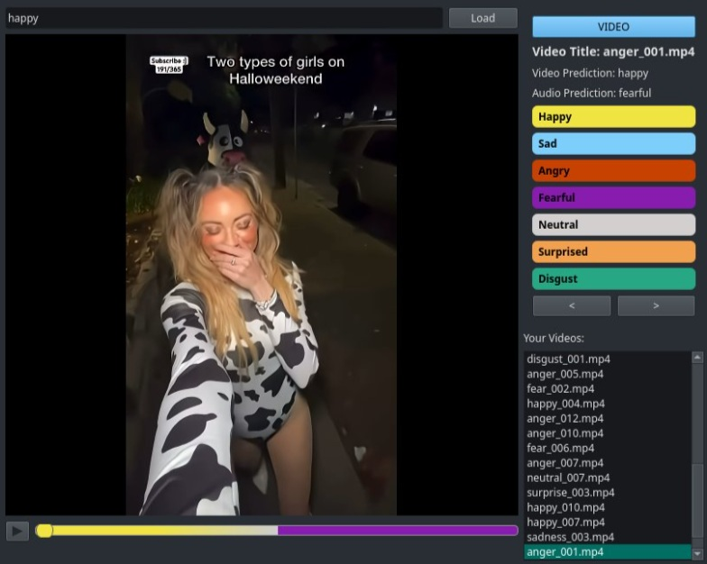

# EmotionClip Video Player

This project is based on [EmotionCLIP](https://openaccess.thecvf.com/content/CVPR2023/papers/Zhang_Learning_Emotion_Representations_From_Verbal_and_Nonverbal_Communication_CVPR_2023_paper.pdf). This emotion detector uses a custom dataset and the final result is a hue bar where the final user can see the emotions shown during the duration of the clip.

## Overview

# Setup

1. Create venv
2. Install requirements by running `pip install -r requirements.txt`
3. Download model .pt file

Run commands for this project are specified . Check path to model is correct!!!

## Usage
### Preprocessing

1. Install ffmpeg by running `pip install ffmpeg`
2. Process the videos to frames (24 fps, images) using videos_to_frames.py
3. Video JSON
- To build `video_result.json` run `contextual_video.py`

- Command contains a tag for model file `--ckpt-path` type .pt

- Requires frame folder and videos

4. Audio JSON

- To build `audio_result.json` run `audio_json_writer.py`

- Extracting wav file run the command with `--audio`

### Video Player

1. Install pyqt5 by running `pip install pyqt5`
2. Download the full videos and their metadata [through this link](https://unioulu-my.sharepoint.com/:u:/g/personal/cherrera25_student_oulu_fi/EePkNwSipepIgkUrxrDZaLMBukzhf1-MnJIK9RkMp7e3HQ?e=VksNRp). You can optionally use `rename.py` to rename the videos, and `rename_audio.py` to rename the audio files.
3. The application requires two files in the project structure:
`videos/audio_result.json`
`videos/video_result.json`

The video and audio files (recommended format .mp4 or .wav) should follow this directory structure:
`videos/video`
`videos/audio`

You can also download the video player, the videos and the metadata [in this link](https://unioulu-my.sharepoint.com/:u:/g/personal/cherrera25_student_oulu_fi/EcfGiAygBUBIsLbj20QUy8sBsZoTtDe54-9kkH1DklWNfw?e=leSmtP) and directly follow the next steps.

4. Run the player with the command `python player.py`.
5. On the interface, type an emotion on a search bar, then hit "Load" to filter the list and load the first matching video. A list of related videos will show on the side. You can also simply click on one of the videos in the list and then click play at the bottom left.
6. Use the "play/pause" button to control the video.
7. Use the < and > buttons to cycle through the videos.
8. Click "Load" with an empty search bar to show all available videos in the list.

# Acknowledgments
Our code is based on [EmotionCLIP](https://github.com/Xeaver/EmotionCLIP).
